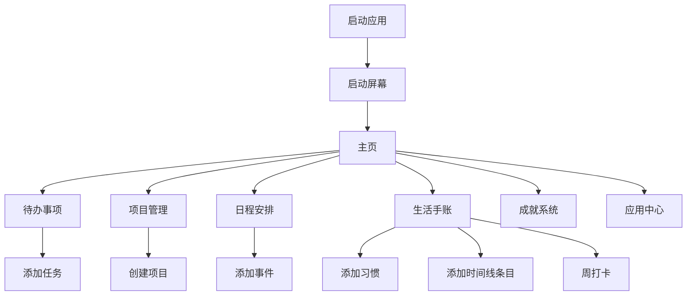

## 1. Product Overview
探索OS是一个现代化的工作台应用，提供待办事项、项目管理、日程安排和生活手账等功能。
- 目标用户为需要高效管理个人和工作任务的专业人士，解决任务管理混乱、时间安排不合理的问题。
- 产品价值在于提供直观、美观的界面，帮助用户提高工作效率和生活质量。

## 2. Core Features

### 2.1 User Roles
| 角色 | 注册方式 | 核心权限 |
|------|----------|----------|
| 普通用户 | 无需注册 | 使用所有功能，数据存储在本地cookie |

### 2.2 Feature Module
1. **主页**：欢迎区域、时间显示、快捷访问、待办事项和项目概览
2. **待办事项**：任务列表、任务添加、任务状态管理
3. **项目管理**：项目创建、进度跟踪、项目详情
4. **日程安排**：日历视图、事件添加、事件管理
5. **生活手账**：习惯追踪、时间线记录、周打卡
6. **成就系统**：成就展示、进度统计
7. **应用中心**：插件和集成管理

### 2.3 Page Details
| 页面名称 | 模块名称 | 功能描述 |
|---------|---------|----------|
| 主页 | 欢迎区域 | 显示问候语、当前时间和日期，提供个性化欢迎信息 |
| 主页 | 快捷访问 | 提供快速导航到其他功能模块的入口 |
| 主页 | 概览卡片 | 显示待办事项完成情况和项目平均进度 |
| 待办事项 | 任务列表 | 显示所有任务，支持按状态筛选和排序 |
| 待办事项 | 任务添加 | 允许用户添加新任务，设置紧急程度和截止日期 |
| 项目管理 | 项目列表 | 显示所有项目，包含名称、进度和截止日期 |
| 项目管理 | 项目详情 | 显示项目详细信息，支持进度更新和打卡 |
| 日程安排 | 日历视图 | 以月视图展示所有事件，支持日期导航 |
| 日程安排 | 事件添加 | 允许用户添加新事件，设置时间和描述 |
| 生活手账 | 习惯追踪 | 显示每日习惯完成情况，支持习惯添加 |
| 生活手账 | 时间线 | 记录用户的活动和思考，支持添加新条目 |
| 生活手账 | 周打卡 | 显示一周的打卡情况，支持每日打卡 |
| 成就系统 | 成就展示 | 显示用户获得的成就和徽章 |
| 成就系统 | 进度统计 | 展示用户的任务完成率和项目进度 |
| 应用中心 | 插件管理 | 显示可用的插件和集成，支持安装和管理 |

## 3. Core Process
用户打开应用后，首先看到启动屏幕，然后进入主页。在主页上，用户可以通过快捷访问或侧边栏导航到其他功能模块。用户可以添加待办事项、创建项目、安排日程、记录生活手账等。所有数据都会自动保存到本地cookie中，确保刷新页面后数据不丢失。

## 4. User Interface Design
### 4.1 Design Style
- 主色调：青色系（#0d9488 - #14b8a6）
- 辅助色：蓝色（#3b82f6）、绿色（#10b981）
- 按钮风格：圆角设计，带有轻微的玻璃态效果
- 字体：Inter（无衬线字体），大小范围从12px到36px
- 布局风格：卡片式布局，带有玻璃态效果和微妙的阴影
- 图标风格：线性图标，简洁现代

### 4.2 Page Design Overview
| 页面名称 | 模块名称 | UI元素 |
|---------|---------|--------|
| 主页 | 欢迎区域 | 大字体问候语，渐变背景，实时时间显示，日期显示 |
| 主页 | 快捷访问 | 网格布局的卡片，每个卡片包含图标和文字，悬停效果 |
| 主页 | 概览卡片 | 玻璃态卡片，包含图标、数字和描述，带有微妙的动画效果 |
| 待办事项 | 任务列表 | 卡片式任务项，带有复选框、优先级标记和截止日期 |
| 项目管理 | 项目列表 | 卡片式项目项，包含进度条、名称和截止日期 |
| 日程安排 | 日历视图 | 月历布局，事件以不同颜色标记，悬停显示详情 |
| 生活手账 | 习惯追踪 | 水平排列的习惯项，带有完成/未完成状态，添加按钮 |
| 生活手账 | 时间线 | 垂直时间线，每个条目包含时间、标题和描述 |
| 生活手账 | 周打卡 | 七列网格，每列代表一天，带有打卡按钮和状态显示 |
| 成就系统 | 成就展示 | 网格布局的成就卡片，包含徽章、名称和描述 |
| 应用中心 | 插件管理 | 卡片式插件项，包含图标、名称、描述和安装按钮 |

### 4.3 Responsiveness
- 设计采用桌面优先原则，同时支持平板和移动设备
- 在小屏幕设备上，侧边栏会折叠为抽屉式菜单
- 卡片布局会根据屏幕宽度自动调整列数
- 触摸设备优化：增大点击区域，支持触摸手势

### 4.4 3D Scene Guidance
- 不适用，本项目为2D界面应用