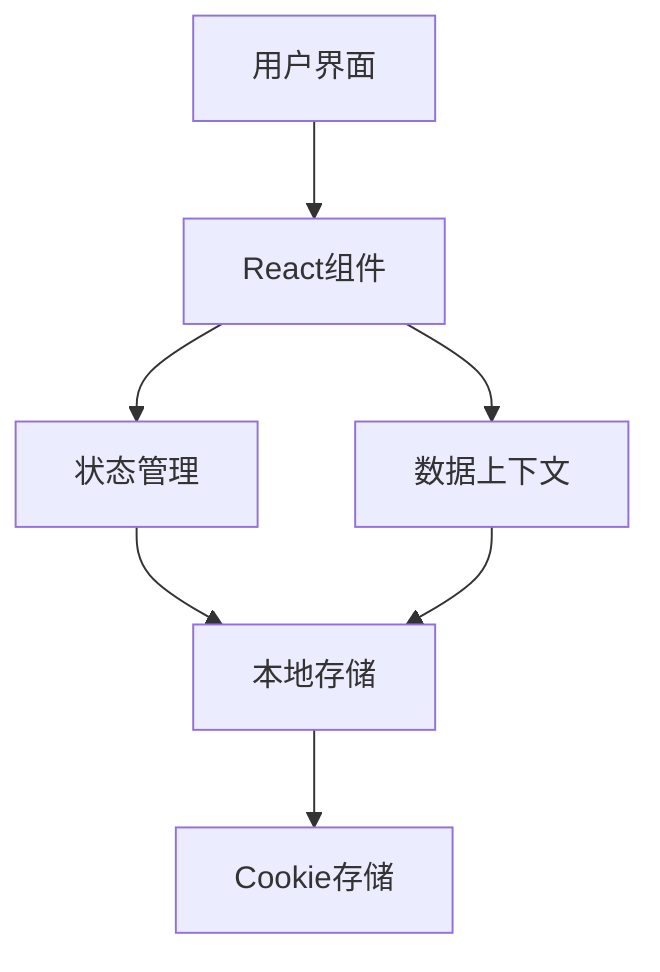
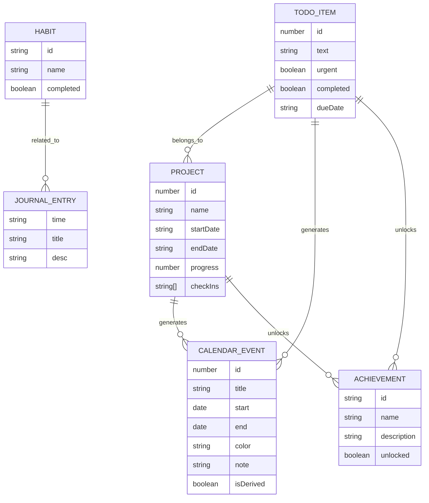

## 1. Architecture Design

## 2. Technology Description
- Frontend: React@19 + TailwindCSS@4 + Vite
- Initialization Tool: Vite
- Backend: None (使用本地存储)
- Database: None (使用Cookie存储)

## 3. Route Definitions
| 路由 | 目的 |
|------|------|
| /home | 主页，包含欢迎区域、快捷访问和概览 |
| /todo | 待办事项页面 |
| /projects | 项目管理页面 |
| /calendar | 日程安排页面 |
| /journal | 生活手账页面 |
| /achievements | 成就系统页面 |
| /apps | 应用中心页面 |

## 4. API Definitions
- 不适用，本项目使用本地存储，无后端API

## 5. Server Architecture Diagram
- 不适用，本项目为纯前端应用

## 6. Data Model
### 6.1 Data Model Definition

### 6.2 Data Definition Language
- 不适用，本项目使用Cookie存储，无数据库表结构